# AI Shijing Paintings

An experiment of using AI to understand ancient Chinese Poem and reconstruct paints.

Jiangyun Pan 22044483

**Trained Weight** 
https://1drv.ms/f/s!Ag4vhDewz-hXjuYqpj177UZzzQPAJw?e=iwd5rM 

GitHub Repository: [https://github.com/Pannic17/C3-Final](https://github.com/Pannic17/C3-Final)

Video Link: [https://ual.cloud.panopto.eu/Panopto/Pages/Viewer.aspx?id=4ac4dad6-ce92-4f3b-b9ed-b02a0108ad95](https://ual.cloud.panopto.eu/Panopto/Pages/Viewer.aspx?id=4ac4dad6-ce92-4f3b-b9ed-b02a0108ad95)

For more detail links about datasets, trained models, please refer to the GitHub readme file.

China has a long history of poetry, spanning over thousands of years. One of the most famous and oldest existing collections is called 诗经Shijing, also known as the Book of Songs. It is an ancient Chinese anthology of poetry that dates back to the Zhou dynasty (11th to 7th centuries BCE). However, after three thousand years of evolution, the Chinese language has undergone significant changes, giving rise to different stages and varieties. Nowadays, Chinese people can read and enjoy the literature after education, but the understanding is still a problem for most people.

When I read the poems from ancient China, I was amazed to discover that the pre-Qin period (meaning before the Chinese feudal period) had many interesting ways of life. In some of the poems, the ideas expressed seem very progressive even by today's standards, such as the expression of feminism, hoping that women could independently resist domestic violence, or having an open attitude towards homosexual relationships.

Also, in Chinese traditional art forms, poems always come with a painting of the scene and feeling they describe. At the same time, I discovered that throughout history, many painters attempted to depict such scenes. However, unfortunately, as time passed, some artworks were lost, and others were plundered by colonizers. So, I am thinking of a way to bring Chinese back to the ancient times to understand their classics and extracting progressive ideas from Chinese history. Meanwhile, such a method could restore the art of Chinese paintings. The project is about using AI to generate paintings according to Chinese poems.

#### Some of the results

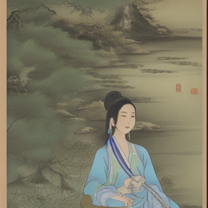  
**蒹葭Jianjia** A serene river, surrounded by lush vegetation. A prince gazes longingly at a beautiful lady, seeking her companionship.

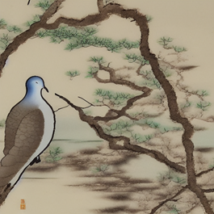  
**关睢Guansui** A moonlit river islet with two turtle-doves cooing on a branch. A graceful maiden stands by, her gaze reflecting longing. Water-plants sway in the current as the nobleman's thoughts turn and twist.

Thus, my project aims to use neural network and artificial intelligence to understand Chinese poems and train my specific diffusion model with a traditional Chinese painting style. I feed ChatGPT API with the original Chinese poem and its English translation with a tested prompt to guide ChatGPT to imagine a scene for the diffusion model to draw. Then, I trained my own stable diffusion model via LoRA (Low-Rank Adaptation of Large Language Models) to get a specific traditional Chinese painting style. With my trained model, I can get a painting from a Chinese poem.

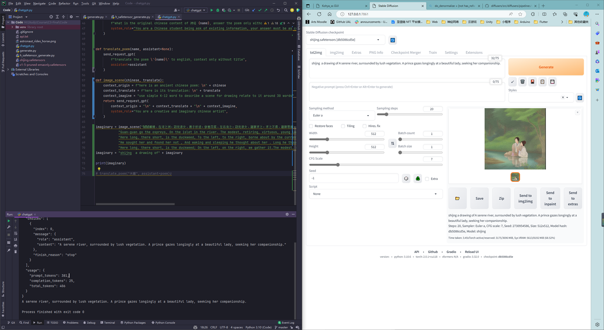
The left is Python code that can intake the poem and send the prompt to the ChatGPT API to get a prompt for drawing. The right is the stable diffusion LoRA model that takes the generated prompt to generate a traditional Chinese

## Stable Diffusion LoRA training

To train a LoRA model, I used integrated stable diffusion webui toolkits from GitHub: [bmaltais/kohya_ss](https://github.com/bmaltais/kohya_ss).

The author provided a web GUI for stable diffusion training, with a very simple interface. I could preprocess, label, and train my own stable diffusion model based on vanilla default diffusion models.

### Dataset

The optimal dataset should be extracted from classical traditional Chinese painting. I browsed and downloaded some famous paintings from museum websites (public copyright):
- [shuge.org](https://new.shuge.org/meet/topic/38968/)
- [yihua.art](https://yihua.art/yubi-shijingtu.html)
- [shuge.org](https://new.shuge.org/view/fang_song_yuan_ben_jin_ling_tu/#prev)
- [dpm.org.cn](https://www.dpm.org.cn/collection/paint/228226.html)

I found a painting, 御笔诗经图 (Yubi Shijing Tu), drawn in the Qing Dynasty (approximately 1700 AD), by the imperial painter with the emperor’s calligraphy, depicting various themes and scenes of Shijing. So, I selected 30 paintings from the collection and cropped them to the appropriate size for my diffusion model training. LoRA training does not require numerous images for the dataset.

I also tested other paintings such as 仿宋院本金陵图卷 (Fang Songyuanben Jinlin Tujuan) and 清明上河图 (Qingming Shanghe Tu) as datasets, but training from a painting related to Shijing was the best choice.

To label the paintings, I started with my own specific initiation prompt 'Shijing' and labeled them using the BLIP plugin built-in the toolkit. However, the BLIP labels were too simple, so I manually added prompts to the labels by reading the poems and translations myself. The reference is [cti.lib.virginia.edu/shijing/AnoShih.html](https://cti.lib.virginia.edu/shijing/AnoShih.html).

### Training

As I am using an RTX2070 GPU card with only 8GB VRAM, I had to change some of the parameters to make it run smoothly. The parameters I used can be found [here](https://github.com/Pannic17/C3-Final/blob/master/on2070.json), which I referenced from [this source](https://mega.nz/file/zFNjlJAL#uB2uTAvcqLohSUzYBgtuBcAMt4Jnclg6jVV5YE4s0F4).

I also tested the influence of different steps on the result. I tried 100, 600, and 400 with adjusted prompts. The best result was achieved with 400 steps and the adjusted prompt. I also compared the model with the community-contributed model MoXin from [civitai.com](https://civitai.com/models/12597/moxin).

### ChatGPT API and Script Integration

As mentioned earlier, I managed to use the ChatGPT API to generate prompts for the diffusion model. Initially, I thought I could use the ChatGPT API to perform poem context search, translation, and imagination all together. However, it turns out that the answers from ChatGPT 3.5 are not very promising when it comes to Chinese content. It often returns incorrect or made-up poems. Therefore, I decided to stick to the original step of directly inputting the poem and translation and letting ChatGPT handle the imaginative process.

To generate the correct prompt, I used Midjourney for testing. I tried using Chinese as a direct input, but it seems that the diffusion model's text encoder is not trained on Chinese. It only generates some Chinese content that is irrelevant to the intended meaning.

Then, I used the translation as input. The results were good when the translation was simple enough, but for more complex translations, Midjourney didn't quite grasp the intended meaning.

So, I asked ChatGPT to imagine based on the translation, and I got really good results. Since Midjourney is a diffusion model, the tests for LoRA should be good as well if I use ChatGPT for imagining.

Finally, my prompt is as follows:

### Results
https://1drv.ms/f/s!Ag4vhDewz-hXjuVM7amTtbphX2uENw?e=uBOchy
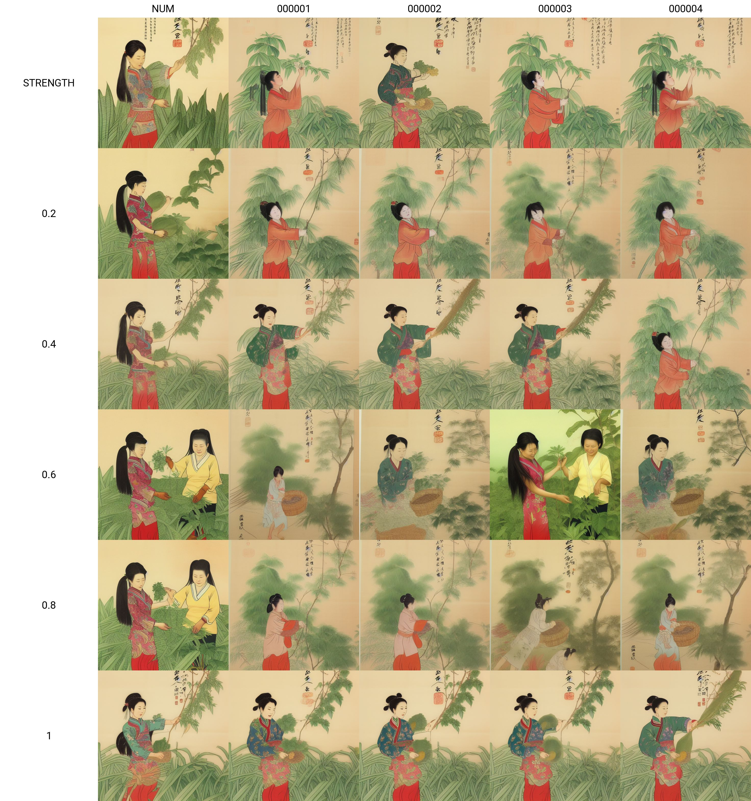
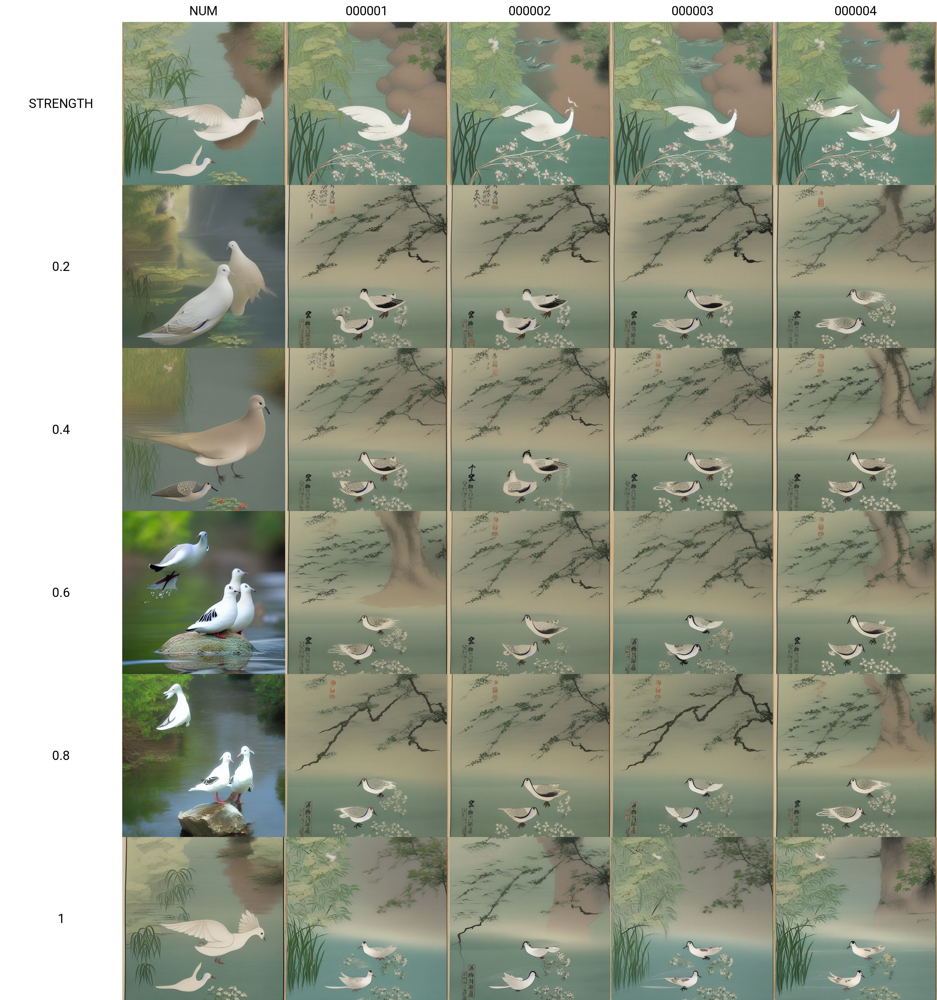
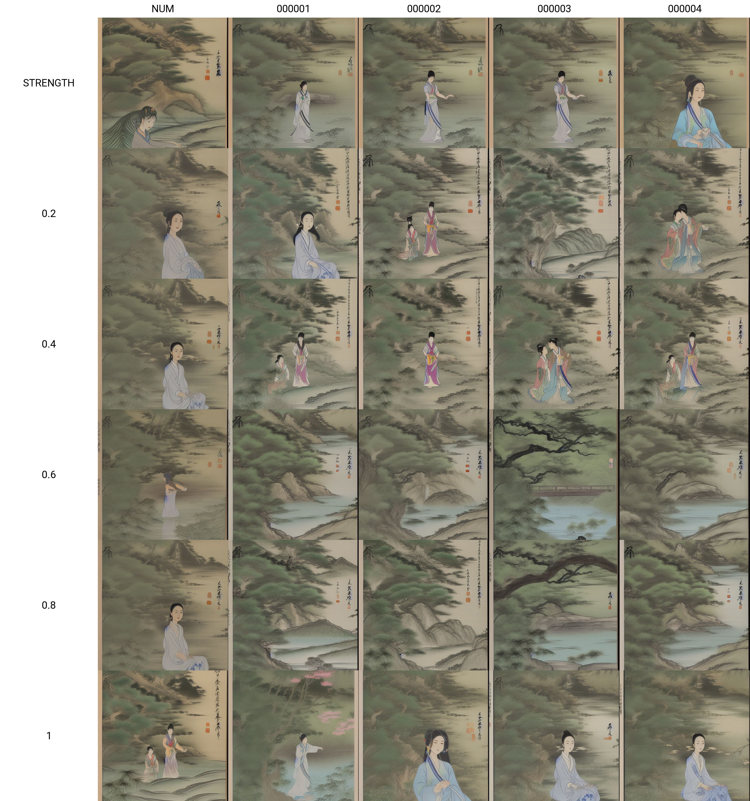
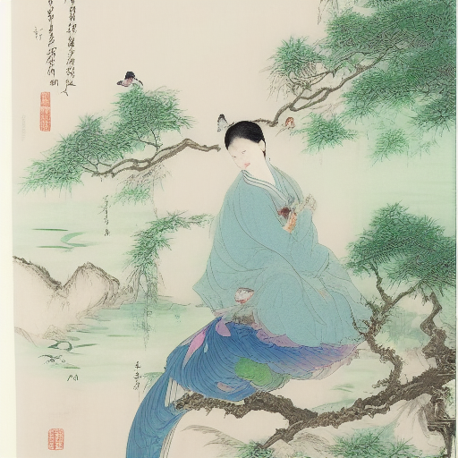
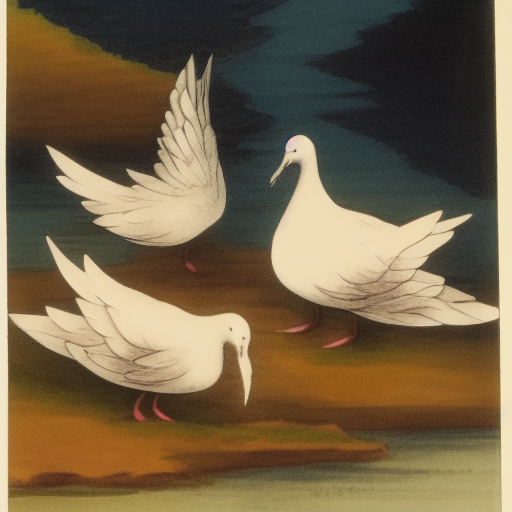
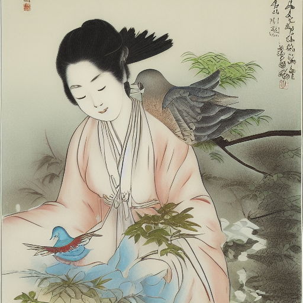
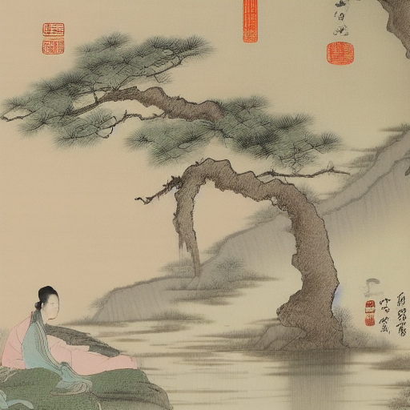
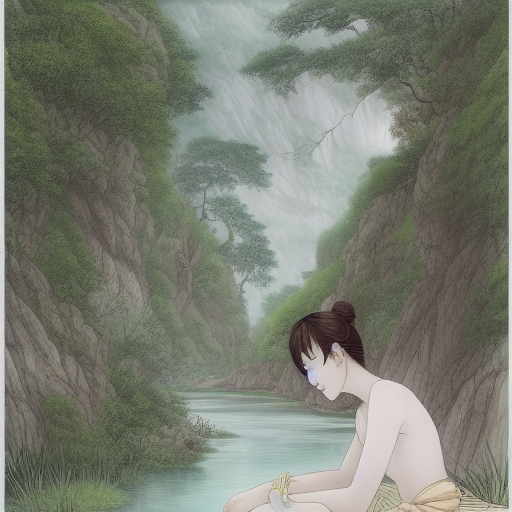

### Process
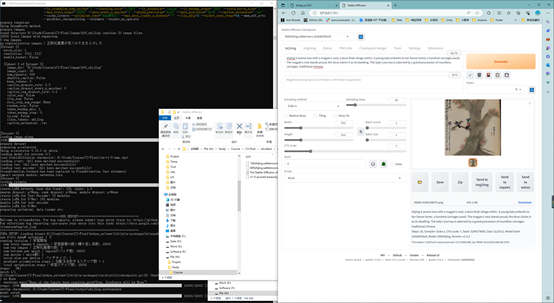
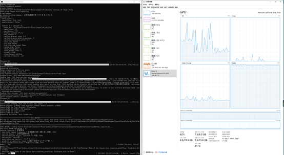
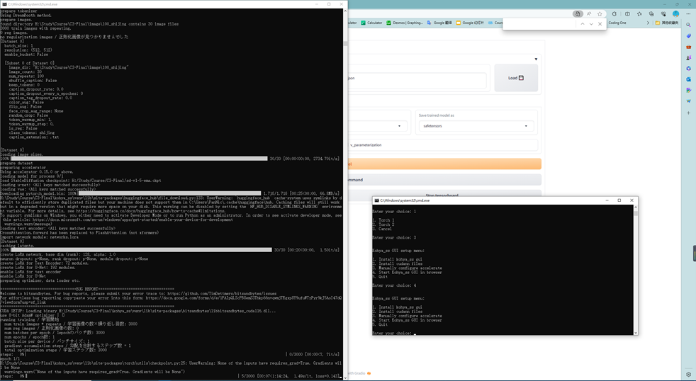

### References

- [LoRA Training](https://rentry.org/lora_train#training-loras)
- [Watermark Removal](https://www.watermarkremover.io/)
- [御笔诗经图](https://new.shuge.org/meet/topic/38968/)
- [仿宋院本金陵图卷](https://new.shuge.org/view/fang_song_yuan_ben_jin_ling_tu/#prev)
- [清明上河图](https://www.dpm.org.cn/collection/paint/228226.html)
- [诗经](https://cti.lib.virginia.edu/shijing/AnoShih.html)
- [Load LoRA](https://github.com/haofanwang/Lora-for-Diffusers/blob/main/convert_lora_safetensor_to_diffusers.py)
- [Train & Generate](https://zhuanlan.zhihu.com/p/590957973)
- [MoXin](https://civitai.com/models/12597/moxin)